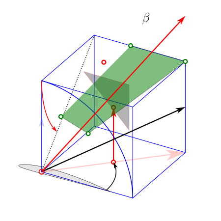
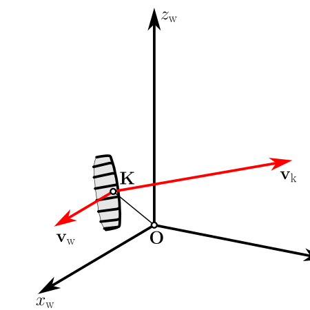
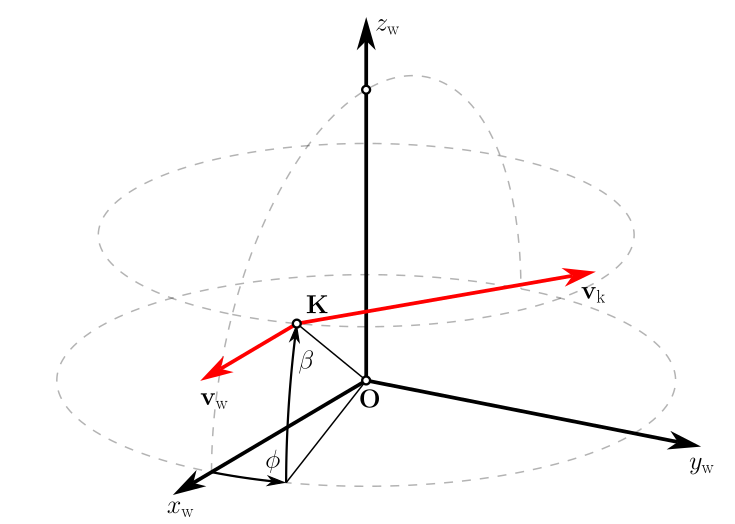
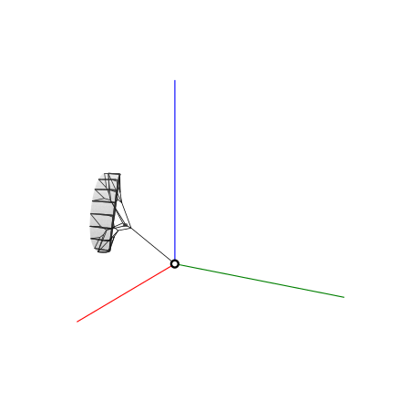

# vplot3d - 3D vector diagrams in SVG format

The library extends the Python toolkit `mplot3d` to programmatically generate 3D vector diagrams in SVG format with a minimum of drawing-related commands. The user can focus on the geometrical or physical problem instead of takling its visualization, delegating the bulk of drawing-related code to the library. The following 3D objects can be instantiated:

- Points,
- Lines and circular arcs,
- Vectors and arc measures,
- Polygons,
- Surface meshes,
- Annotations.

Points and arrowheads (for vectors and arc measures) are generated as native SVG markers to facilitate later postprocessing of the diagram in vector drawing tools, like Illustrator and Inkscape. For the precise positioning of arrowheads, the underlying line or polyline is shortened. This algorithm is one of the key contributions of `vplot3d`.

## System requirements

The library can be used with two options to generate SVG files: a call to `save_svg` generates plain SVG output, while a call to `save_svg_tex` generates plain SVG output and pipes this through Inkscape, using its PDF+Latex output option, and then pdflatex to compile into PDF, with a final conversion back to SVG. This post-processing is useful to render Latex code of mathematical symbols and expressions, using pdflatex.

For using  `save_svg_tex`, the following two executables need to be installed and in the search path:

- [Inkscape](https://inkscape.org/) (free and open-source vector graphics editor)
- [pdflatex](https://www.tug.org/texlive/) (Latex typesetting program)

## Installation

1. Locally clone the repository of download it as zip-file.
2. Go to the root-folder (where the file `pyproject.toml` resides.)
3. Create a virtual environment. 
   ```bash
   python -m venv .venv
   ```
4. Activate the virtual environment.
     
   ```bash
   # linux
   source .venv/bin/activate
   ```
   ```bash
   # Windows (Command Prompt)
   .venv\Scripts\activate
   ```
   ```bash
   # Windows (PowerShell)
   .\.venv\Scripts\Activate
   ```
5. Install dependencies.
   ```bash
   pip install -e .
   ```
6. Now you are ready to use the library. Open your favorite development environment and start coding. The `examples` folder contains several Python files with implemented examples demonstrating the features of `vplot3d`.
6. Once you are finished you can deactivate the virtual environment.
   ```bash
   deactivate
   ```

> [!TIP]
> The example `kite.py` shows the definition of a more complex composite object in a separate, user-specified Python file, `kiteV3.py`. 

## Diagram layout and 3D perspective

To setup the vector drawing `vplot3d` provides an `init` method.

    v3d.plot_zoom, v3d.plot_radius = v3d.init(width, height,
                                              xmin,  xmax,
                                              ymin,  ymax,
                                              zmin,  zmax,
                                              zoom,  elev,  azim )

### Low-level setup
The diagram will be generated as an SVG file. You have to specify the width and height of this SVG diagram in pixels using the `figsize` function of `vplot3d`:

    rcParams['figure.figsize'] = figsize(width_in_pixels, height_in_pixels)

When displaying the SVG file in a web browser or including it in html without explicit dimensions, these dimensions are used. But as a native vector format, SVG is also scalable to any dimensions without quality loss.

At the start of your drawing you also need to define the anticipated 3D data range:

    set_xlim3d([xmin, xmax])
    set_ylim3d([ymin, ymax])
    set_zlim3d([zmin, zmax])

The limiting values define the position of the 3D-diagram in the 2D SVG canvas. For the convenience of the user, the distance of the viewer to the object can be modified by

    ZOOM = value

where the default value of 1 depicts the original data range, a value > 1 zooms out and a value < 1 zooms in.

> [!TIP]
> Using constant size parameters of graphical objects (line width, arrowhead size, etc) across all diagrams of a document, while adjusting only the data range, zoom value and figure size per diagram leads to a uniform graphical representation.

The perspective of the 3D-diagram can be set in the usual way by calling `view_init` with desired elevation and azimuth angle values:

    elev =  30
    azim = -60
    view_init(elev, azim)

> [!CAUTION]
> The library has only been tested for orthographic projection so far. A different projection method could affect the shortening of arrowheads.

## Postprocessing

Because Spyder's SVG renderer does not support markers, these are not drawn in the IPython console window. They do show in a webbrowser or in Inkscape. The included postprocessing with Inkscape, or Inscape-Latex-Inkscape generates a PNG file for output in the IDE's renderer.

## Stepwise diagram buildup or animation

To buildup a diagram in several steps, objects can be added, removed or updated and the current state of the diagram saved with a separate filename.

In this way , it should also be possible to create animations by updating the diagram in an animation look, updating, for example, the position of an object. The generated PNG files could then be easily converted to a video file, using ffmpeg.

## Adding new markers

New markers are added in the markers library `data/markers.svg` in the defs section, using a unique `id`. Only for arrowhead markers, the Marker class dictionary `deltas` needs to be expanded by the line-shortening value matching the new marker path.

## Gallery




