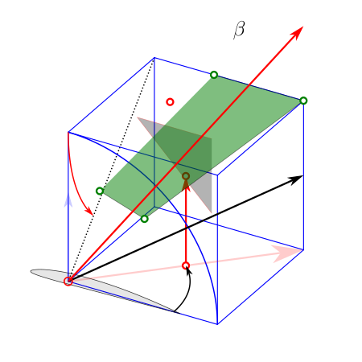
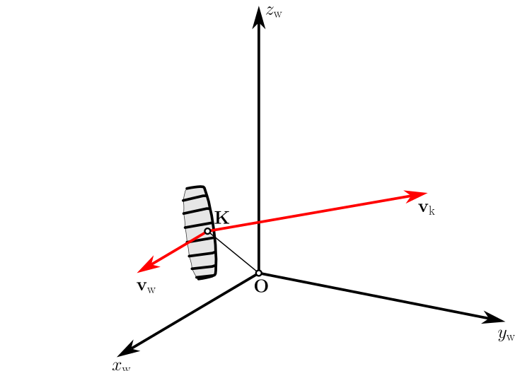
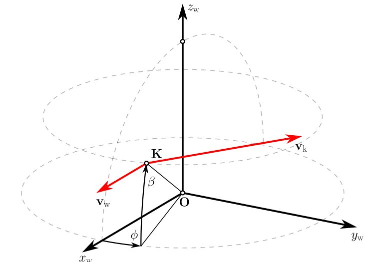
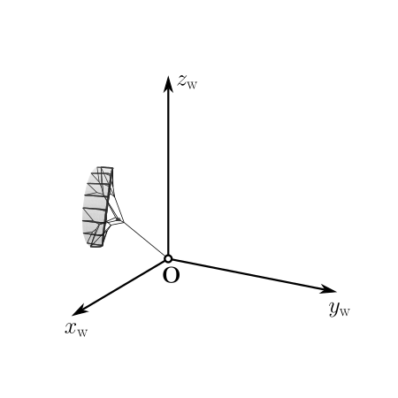

# vplot3d - 3D vector diagrams in SVG format

The library extends the Python toolkit `mplot3d` to programmatically generate 3D vector diagrams in SVG format with a minimum of drawing-related commands. The user can focus on the geometrical or physical problem instead of takling its visualization, delegating the bulk of drawing-related code to the library. The following 3D objects can be instantiated:

- Points,
- Lines and circular arcs,
- Vectors and arc measures,
- Polygons,
- Surface meshes,
- Annotations.

Points and arrowheads (for vectors and arc measures) are generated as native [SVG markers](https://jenkov.com/tutorials/svg/marker-element.html) to facilitate later post-processing of the diagram in vector drawing tools, like Illustrator and Inkscape. For the precise positioning of arrowheads, the underlying line or polyline is shortened. This algorithm is one of the key contributions of `vplot3d`.

## System requirements

The library can be used with two options to generate SVG files: a call to `save_svg` generates plain SVG output, while a call to `save_svg_tex` generates plain SVG output and pipes this through Inkscape, using its PDF+Latex output option, and then xelatex to compile into PDF, with a final conversion back to SVG. This post-processing is useful to render Latex code of mathematical symbols and expressions, using xelatex.

For using  `save_svg_tex`, the following two executables need to be installed and in the search path:

- [Inkscape](https://inkscape.org/) (free and open-source vector graphics editor)
- [xelatex](https://www.tug.org/texlive/) (Latex typesetting program)

> [!WARNING]
> For  `save_svg_tex` to work, your Python script has to reside in the same folder where the output files are generated (i.e. you can not pass a path in the call to `save_svg_tex`).

To generate SVG frame-by-frame animations, the following tool needs to be installed

- [svg2fbf](https://github.com/Emasoft/svg2fbf#installation) (converts a collection of SVG files into a single FBF.SVG file)

This tool is not called via `vplot3d` but used in a separate post-processing step.

## Installation

1. Locally clone the repository or download it as zip-file and unpack it.
2. Go to the root-folder (where the file `pyproject.toml` resides.)
3. Create a virtual environment:
   ```bash
   python -m venv .venv
   ```
   This will install the virtual environment in the (hidden) folder `.venv` in the project's root directory.
4. Activate the virtual environment. On Linux (terminal command line):
   ```bash
   source .venv/bin/activate
   ```
   On Windows (Command Prompt)
   ```bash
   .venv\Scripts\activate
   ```
   On Windows (PowerShell)
   ```bash
   .\.venv\Scripts\Activate
   ```
5. Locally install the package and its dependencies:
   ```bash
   pip install -e .
   ```
   The option `-e` ensures editable mode.
6. When finished, the virtual environment is deactivated by:
   ```bash
   deactivate
   ```

> [!TIP]
> The example `kite.py` shows the definition of a more complex composite object in a separate, user-specified Python file, `kiteV3.py`. 

## Usage

Once installed, `vplot3d` can be used from any location on the file system. The `examples` folder includes several Python files demonstrating the different features of `vplot3d`. The general process of programmatically generating vector graphics is described in the following.

### Configuration and module import

In a first optional step, folders for additional user data and user overrides of configuration settings are defined. Examples for user data are nodal coordinate listings of polygons or surface meshes. Configuration settings are specified in a `vplot3d.yaml` file.

```
# Locations of additional user data and user overrides of configuration setting
dat_path = Path.cwd().parent / 'data'
os.environ['CONF_PATH'] = str(dat_path)
from vplot3d.vplot3d import init_view, Point, Vector, save_svg_tex
```

> [!CAUTION]
> Import `vplot3d` always after setting the environment variable `CONF_PATH`.

When `CONF_PATH` is set by the user, `vplot3d` will read configuration settings from the required file `vplot3d.yaml` in this folder. These settings will override the package defaults defined in the package configuration file `config/vplot3d.yaml`. When `CONF_PATH` is not set, the current working directory is searched for an optional file `vplot3d.yaml`.

### Initializing the SVG canvas and the perspective

To initialize a 3D scene, `vplot3d` provides the `init_view` function:
```
fig = plt.figure()
ax = fig.add_subplot(projection='3d', proj_type='ortho')
ax.set_axis_off()

init_view(width=600, height=600,
          xmin=0, xmax=1, ymin=0, ymax=1, zmin=-0.3, zmax=1.5,
          zoom=1.5, elev=30, azim=-60)
```

The `width` and `height` parameters specify the size of the SVG-file in terms of pixels. 
The `xmin`, `xmax`, `ymin`, `ymax`, `zmin`, and `zmax` parameters define the expected value ranges in the model space.
The `zoom` parameter specifies the viewing distance to the model.
The `elev` and `azim` parameters specify the elevation and azimuth angles of the model's perspective.
More information on the view parameters is available [here](https://matplotlib.org/stable/api/toolkits/mplot3d/view_angles.html).

> [!CAUTION]
> The library has only been tested for orthographic projection so far. A different projection method could affect the shortening of arrowheads.

## Adding geometry objects

Once initialized, the following geometrical primitives and objects can be added to the SVG canvas. Please refer to the examples to see how to do this.

### Points

Uses [SVG markers](https://jenkov.com/tutorials/svg/marker-element.html) as symbols to depict the points.

### Lines and circular arcs

### Vectors and arc measures

Uses [SVG markers](https://jenkov.com/tutorials/svg/marker-element.html) as symbols to depict the arrowheads. To precisely meet the target point with the tip of the arrowhead, the line part of the vectors or arc measures is shortened.

### Polygons

Polygons are created as `Poly3DCollection` objects, which, by default, use their own z-sorting algorithm. As a consequence, the `zorder` parameter when creating a `Polygon` object is ignored. To overrule this behavior and enforce a specified `zorder` parameterm, the z-sorting has to be disabled, setting `computed_zorder=False` when creating the `Axes3d` object.

### Surface meshes

### Annotations


## Output

Because Spyder's SVG renderer does not support markers, these are not drawn in the IPython console window. They do show in a web browser or in Inkscape. The included postprocessing with Inkscape, or Inscape-Latex-Inkscape generates a PNG file for output in the IDE's renderer.

> [!CAUTION]
> Using the output option `save_svg` will not show the markers in the Spyder plot window.
> Do not forget to `close()` your program, because this will trigger another graphical output.

## SVG markers

The SVG markers used for points, vectors, and arc measures are read from an external file.

SVG markers that are used as arrowheads require the definition of an additional shortening value. These values are stored in a dictionary `deltas` with the marker names as keys.

## Configuration settings

The default configuration parameter `fontfamily` specifies the font family to use in the LaTeX post-processing step. The value needs to list the name of the system font family, as specified by the `xelatex` font specifications.

## Adding new markers

New markers are added in the markers library `data/markers.svg` in the defs section, using a unique `id`. Only for arrowhead markers, the Marker class dictionary `deltas` needs to be expanded by the line-shortening value matching the new marker path.

## Stepwise diagram buildup and animation

To build a diagram in several steps, objects can be added, removed, or updated, and the current state of the diagram can be saved with a separate filename. 

In this way, animations can be created by updating the diagram in an animation loop, for example, by updating the position of an object. The generated SVG files can then be concatenated by `svg2fbf` into a single SVG file which internally uses [SMIL](https://en.wikipedia.org/wiki/Synchronized_Multimedia_Integration_Language) for animation. More information about `svg2fbf` is available [here](https://github.com/Emasoft/svg2fbf#quick-start).

> [!CAUTION]
> When used in another document, the size of the generated FBF.SVG file needs to be controlled by explicitly setting the `width` or `height` attribute in that document (copy one of the respective values from the `init_view()` call), because the FBF.SVG file is internally coded to `width=100%` and `height=100%`.
> For single-pass animantion that should stop with the last frame, the attribute `fill="freeze"` needs to be set manually in the `<animate>` tag of the FBF.SVG-file.

## Gallery







## Citation
If you use this project in your research, please consider citing it. 
Citation details can be found in the [CITATION.cff](CITATION.cff) file included in this repository.

## License
This project is licensed under the MIT License - see the [LICENSE](LICENSE) file for details.

### Copyright
Copyright (c) 2025 Roland Schmehl
